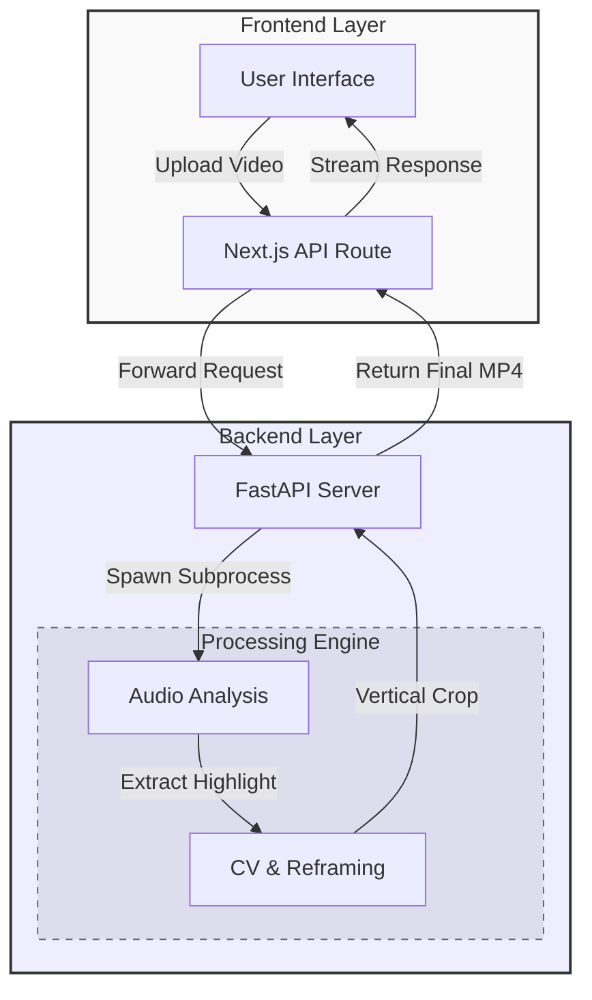

# ClipFarmer 🎬  
**Automated Short-Form Video Clipping Pipeline**

ClipFarmer is an end-to-end video processing system that converts long-form videos into short, vertical, attention-optimized clips for platforms like **Instagram Reels**, **YouTube Shorts**, and **TikTok**.

It automates clip selection, subject tracking, and vertical reframing using real ML inference and production-style video pipelines.

---

## Key Features

- 🔊 Engagement-aware clipping via audio intensity analysis  
- 🧠 Face tracking to keep the subject centered frame-by-frame  
- 📱 Automatic 9:16 vertical reframing  
- 🎧 Lossless audio preservation  
- ⚙️ End-to-end automation from upload to final clip  

---

## System Overview

ClipFarmer is built as a full-stack, cloud-deployed media pipeline.

- **Frontend**: Upload, preview, and playback  
- **Backend**: Video processing, ML inference, FFmpeg orchestration  
- **Infrastructure**: AWS EC2 + Vercel  

---

## Processing Pipeline

1. User uploads a long-form video  
2. Audio analysis using FFmpeg  
3. Loudest continuous **30-second segment** is identified  
4. Frame-by-frame face detection using MediaPipe  
5. Smooth subject center tracking  
6. Video is cropped to **9:16 vertical format**  
7. Original audio is re-muxed  
8. Final short-form clip is produced  

---

## Architecture

### Frontend
- Next.js (App Router)  
- Deployed on Vercel  
- Handles uploads, previews, and output playback  

### Backend
- FastAPI (Python)  
- Hosted on AWS EC2  
- Responsible for video processing, ML inference, and FFmpeg execution  

### Processing Stack
- FFmpeg — audio analysis, clipping, remuxing  
- MediaPipe (Face Detection) — subject tracking  
- OpenCV — frame-level transformations  

### System Flow



---

## Running Locally

### Backend (Python)

#### Requirements
- Python 3.10+ (recommended)  
- FFmpeg  
- Linux / macOS / WSL  

#### Install Dependencies
```bash
pip install fastapi uvicorn mediapipe==0.10.14 opencv-python numpy
sudo apt install ffmpeg libgl1
```
